# Contracts & E-Signature — Visual Walkthrough

A step-by-step demonstration of the feature end-to-end, using a realistic
**Mutual Non-Disclosure Agreement** as the sample document. Every image below was
captured by Playwright driving the **real** admin UI against the **real** backend
(mock signing provider + local file storage). Regenerate with:

```bash
E2E_CONFIG=playwright.contracts-demo.config.ts bash scripts/run-contracts-e2e.sh
```

Spec: [`e2e/contracts-demo.spec.ts`](../../../e2e/contracts-demo.spec.ts).

## Sample documents produced
- **[`mutual-nda.pdf`](mutual-nda.pdf)** — the actual contract PDF the feature
  **generated** from the title + parties + terms (pdfkit). This is the document
  that gets sent for signature.
- **[`signed-contract.pdf`](signed-contract.pdf)** — the completed copy retrieved
  after signing. In this demo the signing engine is the built-in **mock** provider,
  so this file is a placeholder; against a real Documenso instance it is the
  countersigned PDF + a separate audit certificate.

## Walkthrough

| Step | What happens | Screenshot |
|---|---|---|
| 1 | An internal user signs in to the CRM (Growth Escalators). | 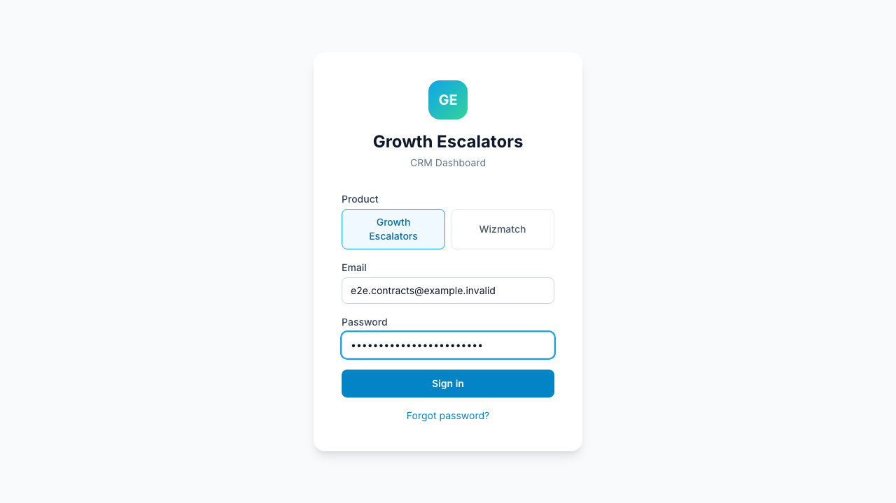 |
| 2 | Opens the **Contracts** module. | 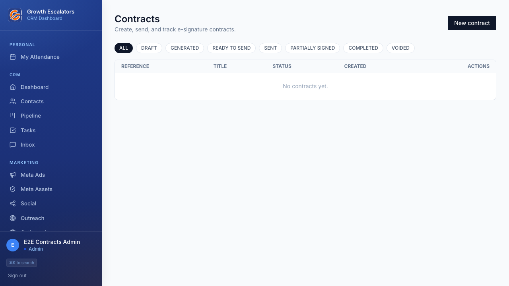 |
| 3 | Creates a contract from the Mutual NDA — client + an internal countersignature, plus the terms. | 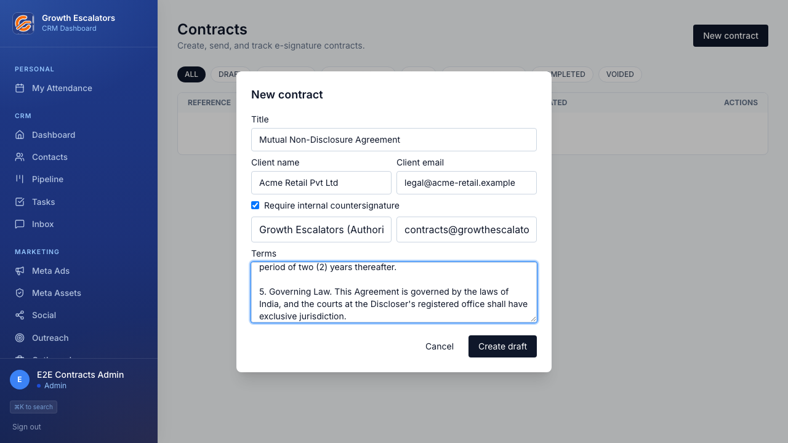 |
| 4 | The contract is a **DRAFT**. | 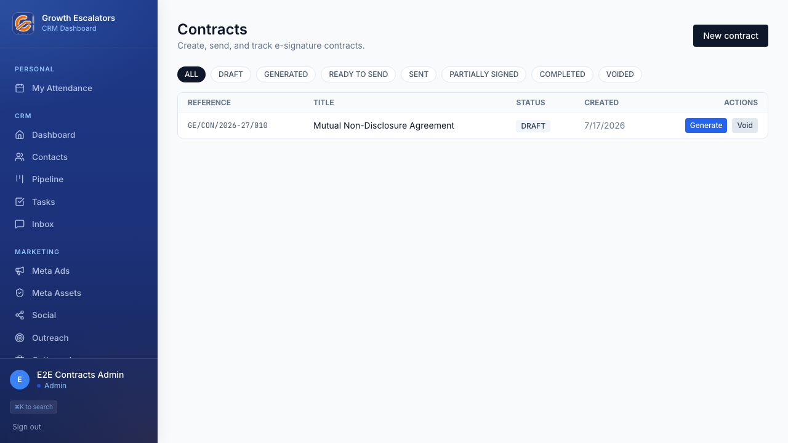 |
| 5 | **Generate** renders the NDA to a PDF (`mutual-nda.pdf`) → **GENERATED**. | 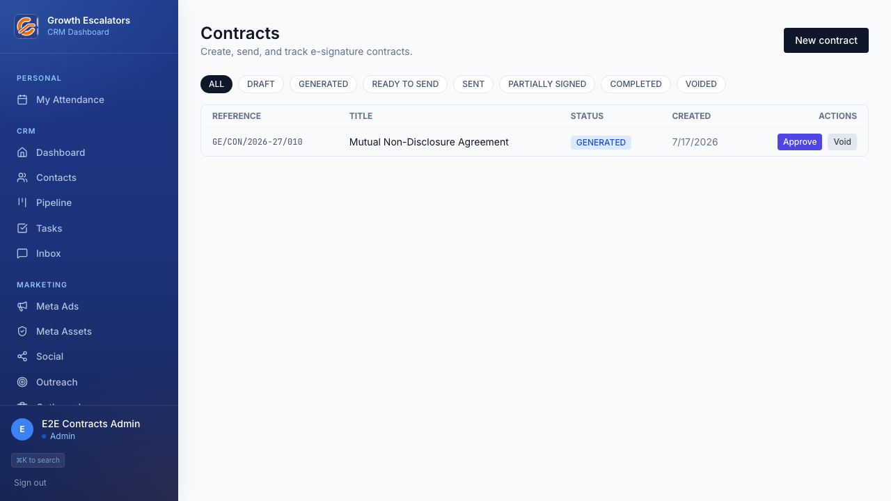 |
| 6 | **Approve** (the approval gate) → **READY_TO_SEND**. | 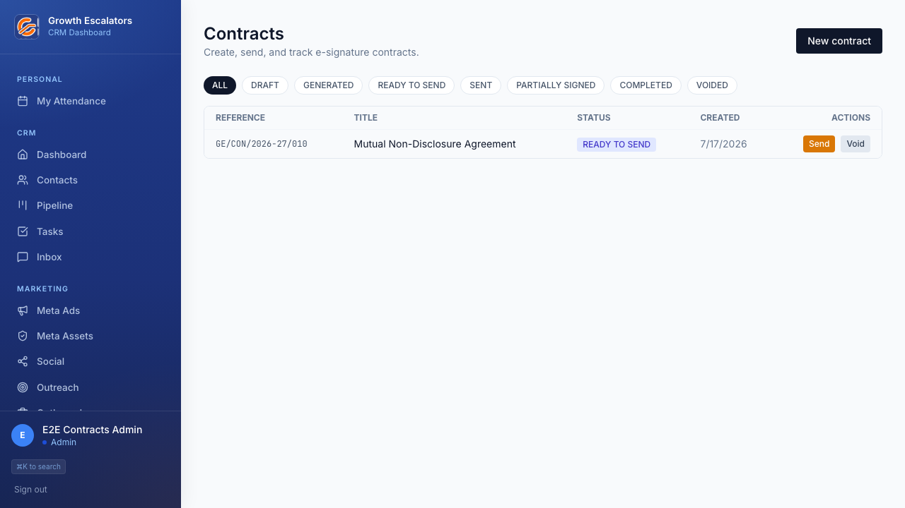 |
| 7 | **Send** → **SENT**; the client is emailed a unique signing link. | 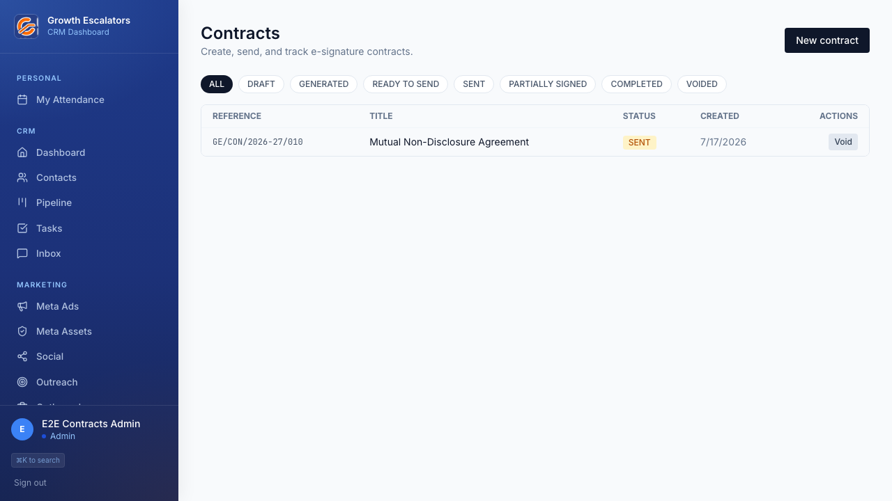 |
| 8 | The detail drawer shows recipient progress + a **Copy link** for the signer. | 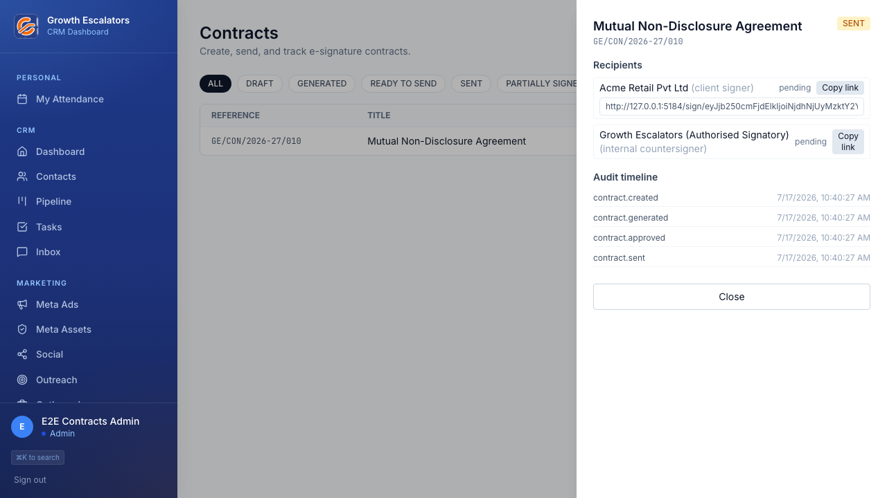 |
| 9 | The external signer opens the link (no login) and reviews the four unchecked **consent** statements. | 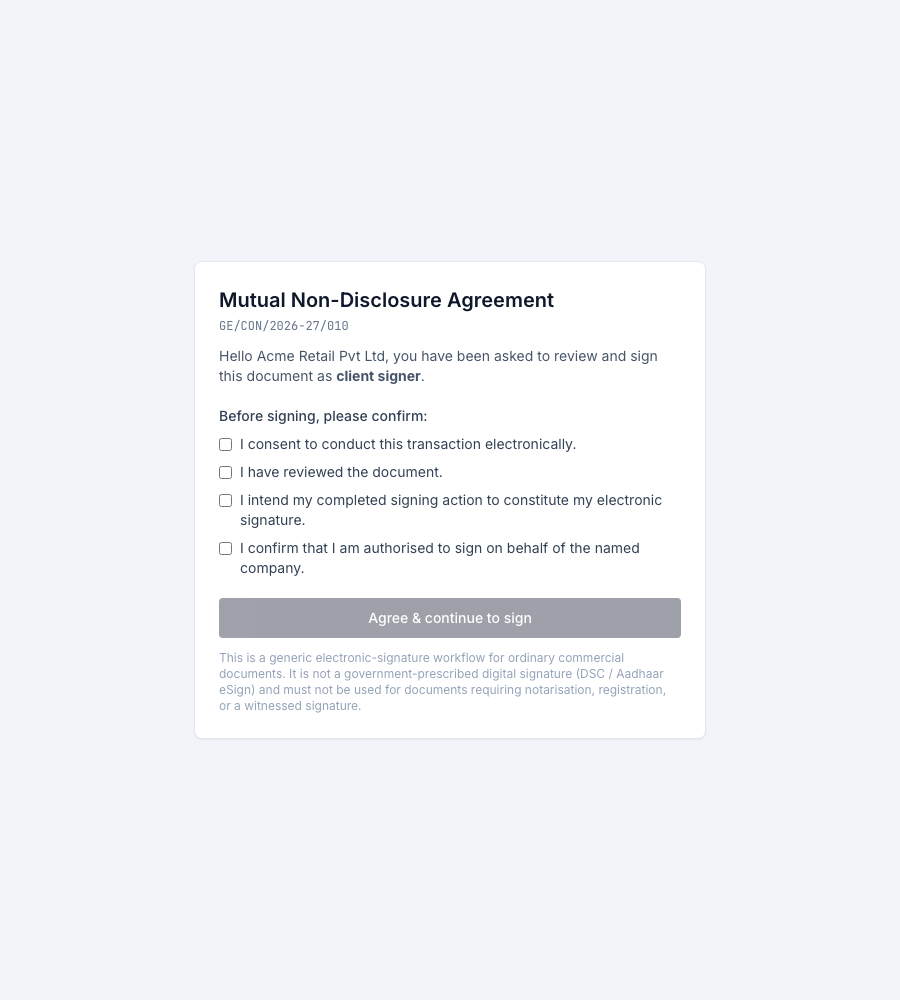 |
| 10 | After consent, the **embedded signing** surface loads inside the page. | 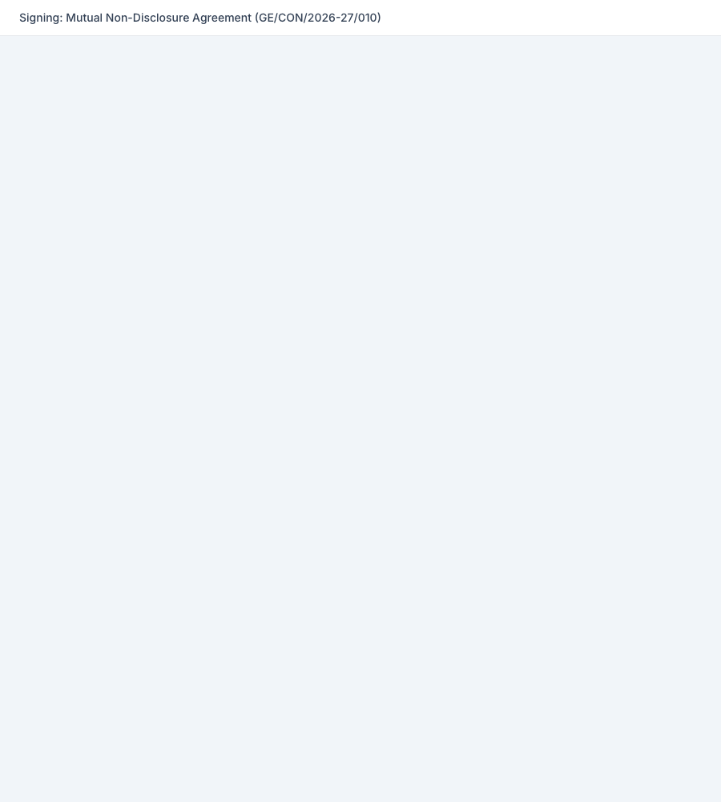 |
| 11 | After the client signs, a verified webhook advances the contract to **PARTIALLY_SIGNED**. | 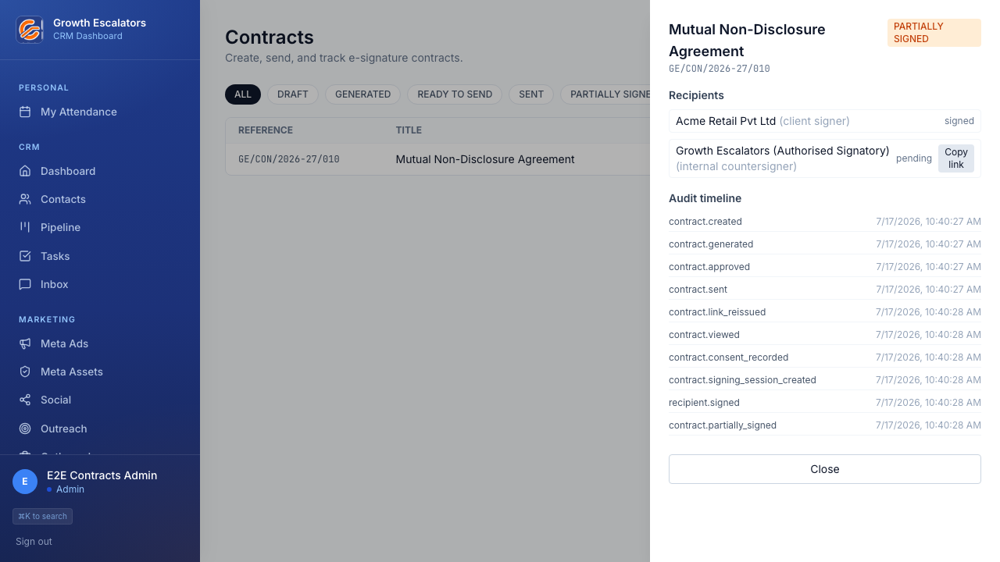 |
| 12 | Growth Escalators **countersigns** (enforced signing order). |  |
| 13 | A final webhook + server-side status re-fetch marks it **COMPLETED**. | 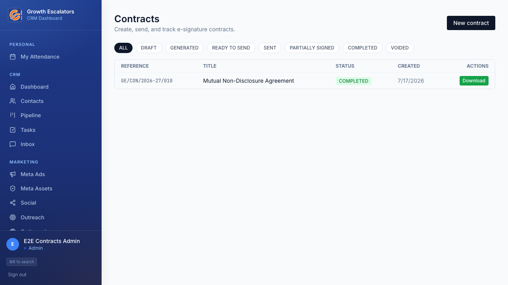 |
| 14 | The full record: both parties signed, downloadable signed PDF + audit certificate, and the immutable **audit timeline**. | 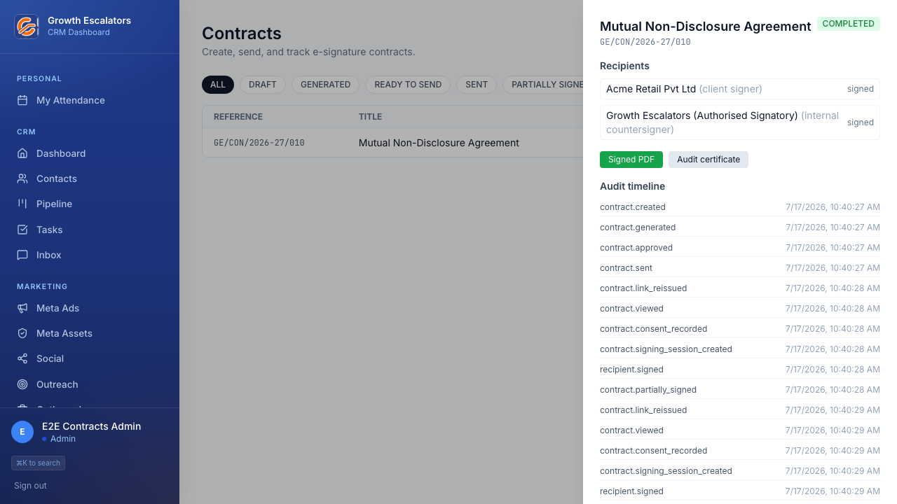 |

## Notes
- Completion is authoritative only via a **verified webhook + server-side status
  re-fetch** — never a browser signal.
- The demo runs with dev/test-only flags (`CONTRACTS_STORAGE=local`,
  `ESIGN_MOCK_AUTOSIGN=1`) that are off by default in production, where the signing
  engine is self-hosted Documenso and documents live in private Cloudflare R2.
